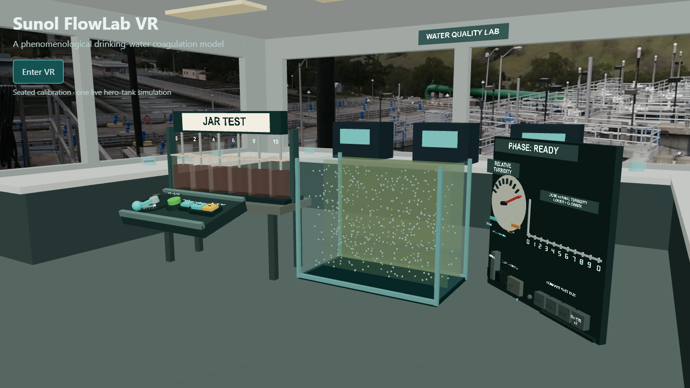

# Sunol FlowLab VR

[](https://github.com/boxwrench/Sunol-Flowlab-VR/actions/workflows/ci.yml)
[](https://github.com/boxwrench/Sunol-Flowlab-VR/actions/workflows/pages.yml)
[](LICENSE)

A VR-first, hands-on coagulation experiment for learning why the best treatment
dose is not always the largest dose.

**[Launch Sunol FlowLab VR](https://boxwrench.github.io/Sunol-Flowlab-VR/)**



Sunol FlowLab VR is an open-source personal educational portfolio project
inspired by drinking-water treatment. It presents one tabletop experiment in a
fictionalized water-quality laboratory. Choose a relative coagulant dose,
observe floc formation and settling, compare the resulting water clarity, and
build a dose-response curve across repeated trials.

The experience runs at the same URL in immersive Meta Quest WebXR and as a
desktop spectator simulation in Chrome or Chromium.

## What it demonstrates

Coagulation has an optimum region:

- too little dose leaves particles insufficiently destabilized;
- a near-optimum dose promotes aggregation and settling;
- too much dose can also produce a poorer result.

The live observation tank makes the treatment cycle visible. A physical gauge
and mounted plot summarize the result, while the six-jar rack preserves static
summaries for canonical doses 0, 2, 4, 6, 8, and 10.

This is a **phenomenological coagulation model**, not dose-prediction software,
a calibrated plant model, CFD, or operational guidance. It does not report NTU
and must not be used for operations, engineering design, or treatment
decisions. All displayed values and the laboratory setting are representative
and fictionalized.

## Try the experience

### Meta Quest

1. Open the [hosted experience](https://boxwrench.github.io/Sunol-Flowlab-VR/)
   in Quest Browser.
2. Sit comfortably, then select **Enter VR**.
3. Use a controller to set a dose from 0 through 10.
4. Press **Start** and watch the complete treatment cycle.
5. Read the **Relative Turbidity** gauge and result plot.
6. Refill, choose another dose, and compare the outcomes.

The v0.1 experience is designed and tested for seated use on Quest 3. It also
includes a physical mute control and selectable Sunol or Hetchy scenery.

### Desktop Chrome or Chromium

Open the same link in a current Chrome or Chromium-based desktop browser. The
lab renders directly as a spectator experience, and its physical controls can
be operated with pointer input. No mobile-specific experience is provided.

## The experiment

| Instrument               | Purpose                                                      |
| ------------------------ | ------------------------------------------------------------ |
| Dose dial                | Selects one of eleven relative doses, 0 through 10           |
| Start button             | Begins one deterministic treatment trial                     |
| Hero observation tank    | Shows rapid mix, flocculation, settling, and clarification   |
| Relative Turbidity gauge | Displays the dimensionless optical-load result               |
| Results plot             | Preserves the complete dose-response history                 |
| Jar Test rack            | Shows static summaries for doses 0, 2, 4, 6, 8, and 10       |
| Replay controls          | Compare a limited saved result with the current result       |
| Refill control           | Restores the same deterministic raw-water starting condition |

One live simulation is authoritative. The jars are summaries rather than six
additional simulations, and the plot and experiment log retain results for all
eleven dose settings.

## v0.1 status

The public release candidate is deployed and has passed:

- immersive entry and seated review on Meta Quest 3;
- the final laboratory, dashboard, scenery, labeling, and audio review;
- a hosted Dose 0, Dose 5, and Dose 10 repeat cycle with refills;
- immersive exit and re-entry;
- deterministic dose-sweep and simulation regression checks;
- unit, architecture, browser, type, lint, build, and benchmark checks.

The final no-narration demonstration video and the `v0.1.0` release tag remain.
A sideloadable APK and narration are intentionally deferred.

Detailed evidence is recorded in [PROGRESS.md](PROGRESS.md),
[the implementation plan](IMPLEMENTATION_PLAN.md),
[UX validation](docs/UX_VALIDATION.md), and
[performance notes](docs/PERFORMANCE.md).

## How it works

The application keeps process behavior separate from presentation:

| Area         | Responsibility                                                                           |
| ------------ | ---------------------------------------------------------------------------------------- |
| `src/sim`    | Deterministic state, seeded randomness, aggregation, settling, and relative optical load |
| `src/app`    | Trial lifecycle, orchestration, results, persistence, replay, and audio                  |
| `src/render` | Three.js and React Three Fiber presentation of authoritative state                       |
| `src/xr`     | WebXR sessions and discrete physical input commands                                      |

The simulation uses fixed-capacity representative particles with
mass-conserving deterministic merges. Suspended projected area supplies one
vertically binned, dimensionless relative optical-load record used throughout
the water appearance, gauge, plot, persistence, jar summaries, and result
replay.

Saved replays contain optical-load bands sampled at 10 Hz. They do not record
particles or rerun the simulation. See
[the architecture](docs/ARCHITECTURE.md),
[modeling research amendment](docs/MODELING_RESEARCH_AMENDMENT.md), and
[ghost replay design](docs/GHOST_REPLAY_DESIGN.md).

## Local development

Requirements:

- Node.js 24.12.x
- npm 11.18.x
- current Chrome or Chromium

```sh
npm ci
npm run dev
```

Open `http://localhost:5173`. Development mode includes the Quest 3 IWER
emulator supplied by the pinned XR package. Use `npm run dev:https` when a
same-network headset test requires an HTTPS origin.

Create a production or GitHub Pages build with:

```sh
npm run build
npm run build:pages
```

The physical-device and remote-debugging workflow is documented in
[docs/DEVICE_TESTING.md](docs/DEVICE_TESTING.md).

## Validation

```sh
npm test
npm run acceptance:03d
npm run typecheck
npm run lint
npm run format:check
npm run build
npm run build:pages
npm run benchmark
npm run test:browser
```

The current checkpoint includes 26 repository-contract tests and 140 Vitest
tests across 31 files, plus six rendered Chromium scenarios. Quest evidence is
kept separate from automated browser evidence so headset-specific claims remain
traceable.

## Development approach and AI collaboration

The treatment concept, safety boundaries, review decisions, and final product
judgment come from the project owner's experience in drinking-water treatment.
The application was developed incrementally with OpenAI Codex and GPT-5.6
Thinking assisting with implementation, architecture review, test design,
documentation, and product critique.

The project was not produced from one large prompt. Work was divided into
bounded batches with explicit scope, tests, non-goals, and human acceptance
gates. Generated code and recommendations were reviewed against the intended
treatment lesson and tested in the headset before acceptance.

## Contributing

Contributions from water professionals, educators, designers, and developers
are welcome. Read [CONTRIBUTING.md](CONTRIBUTING.md) and the binding
[public-data boundary](docs/DATA_BOUNDARY.md) before submitting changes.

Please do not contribute sensitive facility information, proprietary operating
values, official branding, or material that implies endorsement.

## License

Sunol FlowLab VR is available under the [MIT License](LICENSE).
