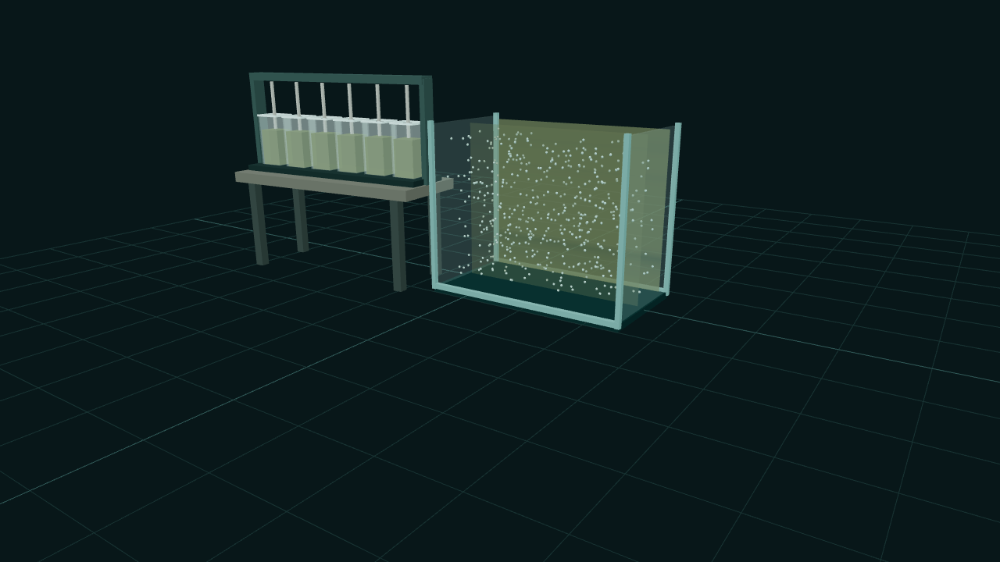
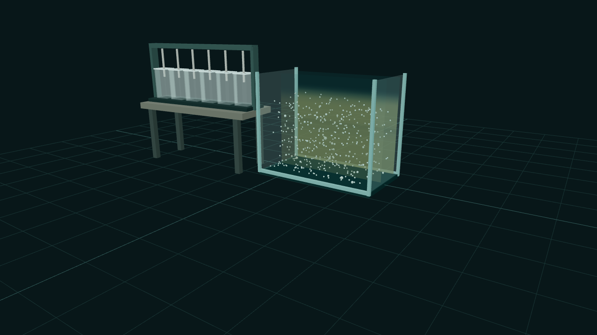
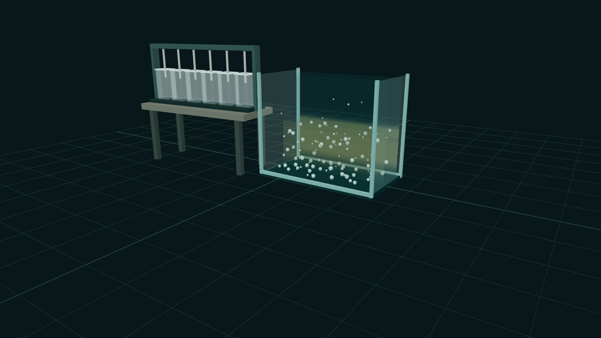

# Batch 03 Recognition and Outcome Review

**Candidate status:** 03R.1 apparatus candidate ready for fresh Part 1 recognition review; outcome review passed
**Model configuration:** fnv1a32-e8bf13e7
**Capture date:** 2026-07-15
**Instructions:** Review the images before opening source files or implementation
notes. Do not inspect the local answer key in `test-results`.

The outcome review below is accepted and retained as evidence. The current
apparatus image is the repaired 03R.1 candidate with six identical frozen
raw-water fills. Repeat Part 1 only with fresh blinded participants where
practical; do not repeat Part 2 unless the accepted A/B/C files change.

## Part 1 - Unlabeled apparatus recognition

Without additional explanation:

1. What do you think this apparatus represents?
2. What would you expect to do here?
3. Which area appears to be the primary active experiment?
4. Do the six small vessels look like live simultaneous processes, static
   comparisons, or something else?

For the required blind recognition gate, record the participant's role, date,
exact or carefully paraphrased response, and tested commit in
[UX_VALIDATION.md](UX_VALIDATION.md).

## Part 2 - Operator outcome review

The three completed outcomes below use the same raw water, seed, duration, and
simulation configuration. Their dose identities are shuffled.

### Comparison A

### Comparison B

### Comparison C

Answer without inspecting the local key:

1. Which outcome has the best finished-water clarity?
2. Which two outcomes appear less effective?
3. Does the best outcome read clearly without labels or a plot?
4. Do the settling, residual haze, and relative floc appearance communicate a
   plausible qualitative jar-test lesson?
5. Does any image imply calibrated dose prediction, operating guidance, or more
   physical fidelity than the model actually provides?
6. What one visual change, if any, is most important before accepting Batch 03?

This operator-informed review does not replace the separate blind apparatus
recognition response from someone who did not design the project.
